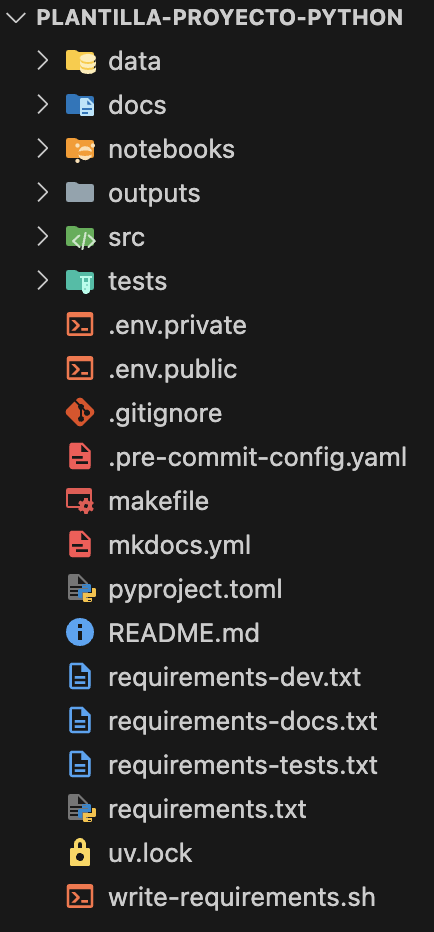

# Plantilla para proyectos: Python

Click [aquí](https://alejpelo.github.io/plantilla-proyecto-python/) para acceder a la documentación completa en línea.

<!--docs-start-->

## Descripción

Plantilla para organizar proyectos que usan **Python** e incorpora mejores prácticas relacionadas con:

- _Version control_: [Git](https://git-scm.com/) (libro: [_Pro Git_](https://git-scm.com/book/en/v2), tutorial: [_Getting Git Right: Learn Git with Tutorials, News and Tips_](https://www.atlassian.com/git))
- _Project management_, _Virtual environments_ y _Dependencies management_: [uv](https://docs.astral.sh/uv/)
- _Static typing_: [mypy](https://mypy-lang.org/)
- _Code formatting_, _Linting_ y _Style enforcement_: [Ruff](https://beta.ruff.rs/docs/)
- _Package vulnerability analysis_: [pip-audit](https://pypi.org/project/pip-audit/)
- _Pre-Commit hooks_: [pre-commit](https://pre-commit.com/)
- _Documentation_: [MkDocs](https://www.mkdocs.org/), [Material for MkDocs](https://squidfunk.github.io/mkdocs-material/), [Google docstrings](https://google.github.io/styleguide/pyguide.html#38-comments-and-docstrings)
- _Environmental variables_ y _`.env` files_: [Pydantic-Settings](https://docs.pydantic.dev/latest/concepts/pydantic_settings/)
- _Logging_: [Loguru](https://github.com/Delgan/loguru)
- _Debugging_: [_The Python Debugger_](https://docs.python.org/3/library/pdb.html) (tutorial: [_Python Debugging With Pdb_](https://arc.net/l/quote/ggofsxtp)), [IceCream](https://github.com/gruns/icecream)
- _Testing_: [pytest](https://docs.pytest.org/en/stable/) (tutorial: [Effective Python Testing With Pytest](https://realpython.com/pytest-python-testing/)), [pytest-cov](https://pytest-cov.readthedocs.io/en/latest/)

Opcionalmente:

- `dvc`: _Data version control_: [DVC](https://dvc.org/), (ver página [_Data version control_](docs/otros/dvc.md) para más detalles)
- `notebooks`: _Jupyter notebooks_: [Jupyter kernels for Spyder and VS Code](https://github.com/spyder-ide/spyder-kernels?tab=readme-ov-file)

## Estructura

El proyecto usa la siguiente estructura de carpetas y archivos:

<figure markdown>
  { width=50% }
  <figcaption>Estructura de carpetas y archivos del proyecto</figcaption>
</figure>

A continuación se describe el propósito de cada una de las carpetas:

:material-folder: `data/`

:   Carpeta para almacenar los archivos de datos (e.g. archivos `.csv`, `.parquet`, `.xlsx`, ...). Dentro de la carpeta se pueden crear sub-carpetas para almacenar los datos en distintos estados (e.g. crudos (_raw_), pre-procesados, procesados, ...).

    Esta carpeta **NO** debe estar versionada con Git, y por defecto, está incluida en el `.gitignore`. 
    
    Se incluye una sub-carpeta especial (`querys/`) destinada a almacenar los _querys_ (archivos `.sql`) que se utilizan para generar los datos. Esta sub-carpeta si se debe versionar en Git, y por defecto, está configurada para que así sea.
    
    Para hacer versionamiento de los datos y/o modelos, se debe hacer uso lo explicado en la práctica relacionada con [_Data version control_](otros/dvc.md).

:material-folder: `docs/`

:   Carpeta para almacenar y gestionar la documentación del proyecto. Se administra usando [MkDocs](https://www.mkdocs.org/), [Material for MkDocs](https://squidfunk.github.io/mkdocs-material/) y [Google docstrings](https://google.github.io/styleguide/pyguide.html#38-comments-and-docstrings).

:material-folder: `notebooks/`

:   Carpeta para almacenar los cuadernos (_notebooks_. Archivos `.ipynb`) que utilice en el proyecto. Si va a utilizar esta carpeta debe usar la práctica opcional _Jupyter notebooks compatibility_ y seguir las instrucciones para hacer un adecuado versionamiento de los cuadernos.

:material-folder: `outputs/`

:   Carpeta para almacenar los archivos de resultados (e.g. archivos `.pdf`, `.png`, `.csv`, `.parquet`, `.xlsx`, ...). Dentro de la carpeta se pueden crear sub-carpetas para almacenar distintos tipos de resultados (e.g. informes, gráficos, resultados ...).

    Esta carpeta **NO** debe estar versionada con Git, y por defecto, está incluida en el `.gitignore`.
    
    Para hacer versionamiento de los datos que hagan parte de los resultados, y por lo tanto se almacenen dentro de esta carpeta, se debe hacer uso lo explicado en la práctica relacionada con [_Data version control_](otros/dvc.md).

    Si genera informes, se recomienda que en ellos incluya el _tag_ que identifica la versión del proyecto que permite reproducirlo. De esta manera, en cualquier otro momento es posible recrear los datos, modelos y código que permite llegar a los mismos resultados.

:material-folder: `src/`

:   Carpeta para almacenar el código (archivos  `.py`). Dentro de la carpeta se pueden crear sub-carpetas para organizar el código adecuadamente.

:material-folder: `tests/`

:   Carpeta para almacenar las pruebas del proyecto (archivos  `.py`). Dentro de la carpeta se pueden crear sub-carpetas para organizar las pruebas adecuadamente. Las pruebas se deben escribir usando [pytest](https://docs.pytest.org/en/stable/).

## Uso

Para instalar la plantilla y empezarla a usar en un nuevo proyecto, debe tener instalado previamente en su equipo, [**Git**](https://git-scm.com/) (versión >= 2.46.0) y [**uv**](https://docs.astral.sh/uv/) (versión >= 0.4.6).

!!! warning "¡Atención!"
    El proyecto tiene un `makefile` y un archivo _shell_ (`write-requirements.sh`) que no corren en WindowsOS por defecto. Por lo tanto es necesario instalar si está utilizando este sistema operativo, adicionalmente, [Make](https://gnuwin32.sourceforge.net/packages/make.htm). (Tutorial: [How to setup/install GNU make on Windows](https://leangaurav.medium.com/how-to-setup-install-gnu-make-on-windows-324480f1da69)).

    Si siguió las instrucciones descritas anteriormente, todas las funcionalidades de la plantilla debe funcionar adecuadamente tanto en WindowsOS, como en MacOS y LinuxOS. Si se le presentan errores:

    1. Es necesario remover el pre-commit que exporta los archivos de librarías requeridas de `.pre-commit-config.yaml`. y no usar `make`.
    2. Agradecemos lo reporte para buscar una solución.

Posteriormente, siga los pasos descritos a continuación:

1. Cree un nuevo repositorio a partir de esta [plantilla](https://github.com/alejpelo/plantilla-proyecto-python) (_template_) con el nombre de su nuevo proyecto. _Asegúrese de marcar la opción **Include all branches**_.

2. Clone el nuevo repositorio en su equipo local.

3. Instale el proyecto, ejecutando:

    ```sh
    uv sync --extra tests --extra docs
    ```

    Si desea usar algunas de las librerías que proporcionan mejores prácticas opcionales, ejecute:

    ```sh
    uv sync --extra tests --extra docs --extra <práctica opcional> # (1)!
    ```

    1. Debe reemplazar `<práctica opcional>` por el código de la práctica opcional. Por ejemplo: `... --extra dvc`.

    Si desea usar más de una práctica opcional, simplemente repita `--extra <práctica opcional>` las veces que necesite al final de la instrucción.

    !!! tip "¡Atención!"
        Si opta por usar la opción `notebooks`, debe agregar a su archivo de configuración de git (`gitconfig`)[^1] las siguientes instrucciones al final del mismo:

        ```sh
        [filter "strip-notebook-output"]
        clean = "uvx jupyter nbconvert --ClearOutputPreprocessor.enabled=True --ClearMetadataPreprocessor.enabled=True --to=notebook --stdin --stdout --log-level=ERROR"
        ```

        Esto le indica a git que al agregar un archivo `.ipynb` al _stage_, debe crearle una copia en la que limpie la metadata y los _outputs_. De esta forma se optimiza el versionamiento de este tipo de archivos, y se garantiza que en el equipo local del usuario se mantienen tanto la metadata como los _outputs_. 

4. En el proyecto se usa [pre-commit](https://pre-commit.com/) para automatizar la verificación del código antes de los _commits_ y de los _pushs_. La librería ya está incluida en las dependencias necesarias para contribuir al proyecto, sin embargo, es necesario configurarla usando las siguientes instrucciones:

    ```sh
    uv run pre-commit install
    uv run pre-commit install --hook-type pre-commit
    uv run pre-commit install --hook-type pre-push
    ```

5. Consulte el archivo `src/tutorial.py` para conocer cómo usar las variables de entorno, el log y cómo hacer _debugging_ fácilmente.

6. Consulte el archivo `docs/tutorial.md` para conocer las capacidades instaladas para documentar el proyecto. Para trabajar en la documentación, ejecute:

    ```sh
    uv run mkdocs serve
    ```

    Esto le permitirá ver en el explorador la versión final de la documentación y hará que esta se actualice en línea en la medida que realice cambios.

**¡Eso es todo!, puede empezar a trabajar en su nuevo proyecto.**

[^1]: Este archivo se encuentra en la siguiente ruta: `~/gitconfig`.

<!--docs-end-->
