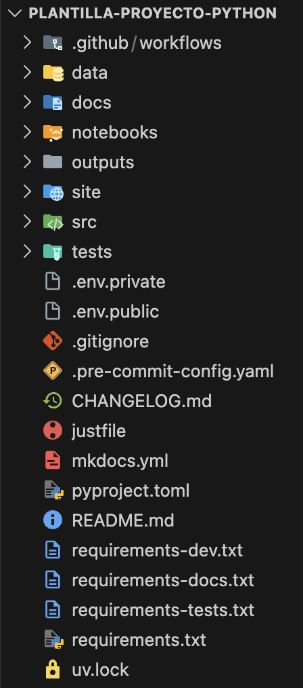

# Plantilla para proyectos: Python

Click [aquí](https://alejpelo.github.io/plantilla-proyecto-python/) para acceder a la documentación completa en línea.

<!--docs-start-->

## Descripción

Plantilla para organizar proyectos que usan **Python** e incorporar mejores prácticas relacionadas con:

- _Version control_: [Git](https://git-scm.com/) (libro: [_Pro Git_](https://git-scm.com/book/en/v2), tutorial: [_Getting Git Right: Learn Git with Tutorials, News and Tips_](https://www.atlassian.com/git))
- _Project management_, _Virtual environments_ y _Dependencies management_: [uv](https://docs.astral.sh/uv/)
- _Static typing_: [Ty](https://docs.astral.sh/ty/)
- _Code formatting_, _Linting_ y _Style enforcement_: [Ruff](https://docs.astral.sh/ruff/)
- _Package vulnerability analysis_: [pip-audit](https://pypi.org/project/pip-audit/)
- _Commit management_: [prek](https://prek.j178.dev/), [Commitizen](https://commitizen-tools.github.io/commitizen/)
- _Documentation_: [MkDocs](https://www.mkdocs.org/), [Material for MkDocs](https://squidfunk.github.io/mkdocs-material/), [Google docstrings](https://google.github.io/styleguide/pyguide.html#38-comments-and-docstrings)
- _Environmental variables_ y _`.env` files_: [Pydantic-Settings](https://docs.pydantic.dev/latest/concepts/pydantic_settings/)
- _Logging_: [Loguru](https://github.com/Delgan/loguru)
- _Debugging_: [_The Python Debugger_](https://docs.python.org/3/library/pdb.html) (tutorial: [_Python Debugging With Pdb_](https://arc.net/l/quote/ggofsxtp)), [IceCream](https://github.com/gruns/icecream)
- _Testing_: [pytest](https://docs.pytest.org/en/stable/) (tutorial: [Effective Python Testing With Pytest](https://realpython.com/pytest-python-testing/)), [pytest-cov](https://pytest-cov.readthedocs.io/en/latest/)

Opcionalmente:

- `nb`: _Python notebooks_: [marimo](https://marimo.io/), (ver página [_Notebooks_](docs/otros/notebooks.md) para más detalles)
- `dvc`: _Data version control_: [DVC](https://dvc.org/), (ver página [_Data version control_](docs/otros/dvc.md) para más detalles)

!!! warning "¡Atención!"
    Es conocido que [DVC](https://dvc.org/) puede presentar problemas de compatibilidad cuando se usa en WindowsOS. Se recomienda revisar la [documentación oficial de DVC](https://doc.dvc.org/), particularmente las siguientes páginas:

    - [Installation on Windows](https://doc.dvc.org/install/windows)
    - [How to Run DVC on Windows](https://doc.dvc.org/user-guide/how-to/run-dvc-on-windows)

    Si va a utilizar esta práctica opcional, es preferible usar MacOS o LinuxOS para evitar inconvenientes.

## Estructura

El proyecto usa la siguiente estructura de carpetas y archivos:

<figure markdown>
  { width=50% }
  <figcaption>Estructura de carpetas y archivos del proyecto</figcaption>
</figure>

### Carpetas

A continuación se describe el propósito de cada una de las carpetas:

:material-folder: `.github/`

:   Carpeta para almacenar los archivos que configuran las _GitHub Actions_. Estos archivos están escritos en formato YAML y permiten automatizar tareas como la integración continua, el despliegue continuo, la gestión de incidencias, entre otras.

    En principio no es necesario que modifique estos archivos, pero si desea personalizar las acciones automatizadas del proyecto, puede hacerlo editando los archivos dentro de esta carpeta o creando nuevos archivos según sus necesidades.

:material-folder: `data/`

:   Carpeta para almacenar los archivos de datos (e.g. archivos `.txt`, `.csv`, `.parquet`, `.xlsx`, ...). Dentro de la carpeta se pueden crear sub-carpetas para almacenar los datos en distintos estados (e.g. crudos (_raw_), pre-procesados, procesados, ...).

    Esta carpeta **NO** debe estar versionada con **Git**, y por defecto, está incluida en el archivo `.gitignore` del proyecto.
    
    Se incluye una sub-carpeta especial (`querys/`) destinada a almacenar los _querys_ (e.g. archivos `.sql`, `.graphql` `.gql`) que se utilizan para generar los datos. Esta sub-carpeta si se debe versionar en **Git**, y por defecto, el `.gitignore` del proyecto está configurado para que así sea.
    
    Para hacer versionamiento de los archivos de datos y/o modelos del proyecto, que sean necesarios para asegurar la reproducibilidad del mismo, y se almacenen dentro de esta carpeta, se debe hacer uso lo explicado en la opción relacionada con [_Data version control_](docs/otros/dvc.md).

:material-folder: `docs/`

:   Carpeta para almacenar y gestionar la documentación del proyecto. Se administra usando [MkDocs](https://www.mkdocs.org/), [Material for MkDocs](https://squidfunk.github.io/mkdocs-material/) y [Google docstrings](https://google.github.io/styleguide/pyguide.html#38-comments-and-docstrings).

:material-folder: `notebooks/`

:   Carpeta para almacenar los cuadernos (_notebooks_ usando [marimo](https://marimo.io/)) que utilice en el proyecto.

    Para gestionar (i.e. crear, editar y eliminar) cuadernos (_notebooks_), se debe hacer uso lo explicado en la opción relacionada con [_Notebooks_](docs/otros/notebooks.md).

:material-folder: `outputs/`

:   Carpeta para almacenar los archivos de resultados (e.g. archivos `.pdf`, `.png`, `.txt`, `.csv`, `.parquet`, `.xlsx`, ...). Dentro de la carpeta se pueden crear sub-carpetas para almacenar distintos tipos de resultados (e.g. informes, gráficos, resultados, ...).

    Esta carpeta **NO** debe estar versionada con **Git**, y por defecto, está incluida en el archivo `.gitignore` del proyecto.

    Si se generan informes, se recomienda que en ellos incluya el _tag_ que identifica la versión del proyecto que permite reproducirlos. De esta manera, en cualquier otro momento, será posible recrear los datos, los modelos y el código que permiten llegar a los mismos resultados.

:material-folder: `src/`

:   Carpeta para almacenar el código (i.e. archivos  `.py`). Dentro de la carpeta se pueden crear sub-carpetas para organizar el código adecuadamente.

:material-folder: `tests/`

:   Carpeta para almacenar las pruebas del proyecto (i.e. archivos  `.py`). Dentro de la carpeta se pueden crear sub-carpetas para organizar las pruebas adecuadamente. Las pruebas se deben escribir usando [pytest](https://docs.pytest.org/en/stable/).

### Archivos

A continuación se describe el propósito de algunos de los archivos más importantes del proyecto:

:material-file: `.env.private`

:   Archivo para almacenar las variables de entorno privadas del proyecto. Este archivo **NO** debe estar versionado con **Git**, y por defecto, está incluido en el archivo `.gitignore` del proyecto.

    Para más información sobre el uso de variables de entorno en el proyecto, consulte el archivo `src/tutorial.py`.

:material-file: `.env.public`

:   Archivo para almacenar las variables de entorno públicas del proyecto. Este archivo **SI** debe estar versionado con **Git**.

    Para más información sobre el uso de variables de entorno en el proyecto, consulte el archivo `src/tutorial.py`.

:material-file: `.gitignore`

:   Archivo para especificar los archivos y carpetas que **Git** debe ignorar al momento de hacer seguimiento de los cambios en el proyecto. Este archivo es fundamental para evitar que archivos temporales, archivos de configuración local o archivos generados automáticamente se incluyan en el control de versiones.

    El archivo `.gitignore` del proyecto ya incluye las configuraciones necesarias para ignorar las carpetas `data/` y `outputs/`, entre otros archivos y carpetas comunes que no deben ser versionados.

:material-file: `pre-commit-config.yaml`

:  Archivo para configurar los _hooks_ de [prek](https://prek.j178.dev/) en el proyecto. Este archivo define una serie de reglas y herramientas que se ejecutan automáticamente antes de realizar un _commit_ en **Git**, con el fin de asegurar la calidad del código y mantener un estándar consistente en el proyecto.

    El archivo `pre-commit-config.yaml` del proyecto ya incluye configuraciones para varias herramientas útiles, tales como: "formateadores" de código, linters y verificadores de seguridad.

    Para más información sobre el uso de **pre-commit** en el proyecto, consulte [Uso](#uso) y [Flujo de trabajo](docs/otros/flujo.md).

:material-file: `CHANGELOG.md`

:   Archivo para llevar un registro de los cambios realizados en el proyecto a lo largo del tiempo. Este archivo sigue el formato de [Keep a Changelog](https://keepachangelog.com/en/1.0.0/) y ayuda a los desarrolladores y usuarios a entender la evolución del proyecto, facilitando la identificación de nuevas características, correcciones de errores y cambios importantes entre versiones.

    Este archivo se actualiza automáticamente al hacer _commits_ usando la instrucción `just bump-code-version` (o su alias `just b`). Para más información sobre el uso de **just** en el proyecto, consulte [Uso](#uso) y [Flujo de trabajo](docs/otros/flujo.md).

:material-file: `justfile`

:   Archivo para almacenar las tareas automatizadas del proyecto usando [**just**](https://github.com/casey/just). Este archivo contiene las instrucciones para ejecutar tareas comunes del proyecto, como instalar dependencias, ejecutar pruebas, generar documentación, entre otras.

    Para más información sobre el uso de **just** en el proyecto, consulte [Uso](#uso) y [Flujo de trabajo](docs/otros/flujo.md).

:material-file: `mkdocs.yml`

:  Archivo para configurar la documentación del proyecto usando [MkDocs](https://www.mkdocs.org/) y [Material for MkDocs](https://squidfunk.github.io/mkdocs-material/). Este archivo define la estructura, el tema, las extensiones y otras opciones relacionadas con la generación de la documentación del proyecto.

    Para más información sobre el uso de **MkDocs** en el proyecto, consulte [Uso](#uso) y [Flujo de trabajo](docs/otros/flujo.md).

:material-file: `pyproject.toml`

: Archivo para gestionar las dependencias y la configuración del proyecto usando [uv](https://docs.astral.sh/uv/). Este archivo define las librerías necesarias para el desarrollo y la ejecución del proyecto, así como otras configuraciones relacionadas con el entorno de desarrollo.

    Para más información sobre el uso de **uv** en el proyecto, consulte [Uso](#uso) y [_Librerías adicionales_](docs/otros/librerias.md).

:material-file: `README.md`

: Archivo para proporcionar una descripción general del proyecto, incluyendo su propósito, características principales, instrucciones de instalación y uso, entre otros detalles relevantes. Este archivo es lo primero que los usuarios y colaboradores ven al acceder al repositorio del proyecto.

    El archivo `README.md` del proyecto (i.e. este archivo) ya incluye información básica sobre la plantilla y un enlace a la documentación completa en línea.

:material-file: `requeriments-dev.txt`, `requeriments-docs.txt`, `requeriments-tests.txt` y `requeriments.txt` 

: Archivos para listar las dependencias del proyecto. Aunque el proyecto usa [uv](https://docs.astral.sh/uv/) para gestionar las dependencias, estos archivos pueden ser útiles para herramientas o servicios que esperan encontrar archivos `requirements.txt` en el proyecto (e.g. _GitHub Actions_).

:material-file: `uv.lock`

: Archivo generado automáticamente por [uv](https://docs.astral.sh/uv/) para asegurar que las dependencias del proyecto se instalen de manera consistente en diferentes entornos. Este archivo registra las versiones exactas de las librerías instaladas en el proyecto, incluyendo sus dependencias y sub-dependencias.

    No es necesario modificar este archivo manualmente, ya que se actualiza automáticamente al instalar o actualizar las dependencias del proyecto usando **uv**.

## Uso

Para instalar la plantilla y empezarla a usar en un nuevo proyecto, debe tener instalado previamente en su equipo, [**Git**](https://git-scm.com/) (versión >= 2.52.0), [**uv**](https://docs.astral.sh/uv/) (versión >= 0.9.26) y [**just**](https://github.com/casey/just) (versión >= 1.46.0).

!!! warning "¡Atención!"
    El proyecto incluye algunas funcionalidades que requieren un _shell_ (`sh`) compatible con Unix (e.g. MacOS, LinuxOS).

    Al instalar **Git** en WindowsOS, es posible instalar adicionalmente **Git Bash**, lo que proporciona un _shell_ compatible con Unix. Si realiza esta instalación adicional y configura su sistema para usar Git Bash como _shell_ predeterminado, tal como lo explica la documentación de la instalación de **just**, no debería tener inconvenientes al usar el proyecto en WindowsOS.

    Si se le presentan errores, le agradecemos lo reporte para buscar soluciones.

Posteriormente, siga los pasos descritos a continuación:

1. Cree un nuevo repositorio a partir de esta [plantilla](https://github.com/alejpelo/plantilla-proyecto-python) (_template_) con el nombre de su nuevo proyecto. Asegúrese de marcar la opción _**Include all branches**_.

2. Clone el nuevo repositorio en su equipo local.

3. Instale el proyecto, ejecutando:

    ```sh
    just set-dev-env
    ```

    Si desea usar algunas de las librerías que proporcionan prácticas opcionales, ejecute:

    ```sh
    just set-dev-env <práctica opcional> # (1)!
    ```

    1. Debe reemplazar `<práctica opcional>` por el código de la práctica opcional. Por ejemplo: `"--extra dvc"` o `"--extra nb"`.

    Si desea usar más de una práctica opcional, simplemente repita `<práctica opcional>`, separado por un espacio, las veces que necesite al final de la instrucción.

4. En el proyecto se usan [prek](https://prek.j178.dev/) _hooks_ para automatizar la verificación del código antes de los _commits_ y los _pushs_. La librería ya está incluida en las dependencias necesarias para contribuir al proyecto, sin embargo, es necesario configurar la herramienta usando las siguientes instrucciones:

    ```sh
    just install-prek-hooks
    ```

5. Consulte el archivo `src/tutorial.py` para conocer cómo usar las variables de entorno, el log y cómo hacer _debugging_ fácilmente.

6. Consulte el archivo `docs/tutorial.md` para conocer las capacidades instaladas para documentar el proyecto. Para visualizar en limpio la documentación, ejecute:

    ```sh
    just serve-docs
    ```

    Esto le permitirá ver en el explorador la versión final de la documentación y hará que esta se actualice en línea en la medida que realice cambios.

7. Consulte la sección sobre [Flujo de trabajo](docs/otros/flujo.md) para conocer las recomendaciones para hacer un desarrollo ordenado y eficiente usando la plantilla.

**¡Eso es todo!, puede empezar a trabajar en su nuevo proyecto.**

<!--docs-end-->
