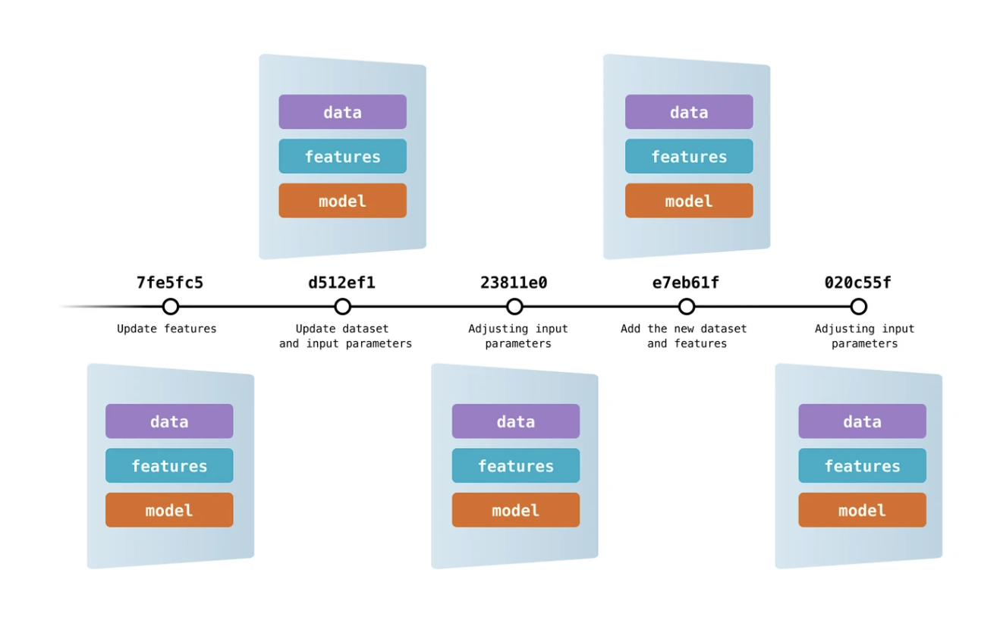

# Data version control

## ¿Qué es?

<figure markdown>
  { width=80% }
  <figcaption>Versionamiento de datos y modelos junto con el código (en Git)</figcaption>
</figure>

El versionamiento de datos y modelos es una técnica que permite hacerle trazabilidad a "archivos" de datos o modelos, que normalmente son más pesados (10s-100s MB a 10s GB, incluso en ocasiones TBs), junto con el versionamiento del código. El objetivo es que en adición y concordancia con el código, se puedan "versionar" los datos de entrada y/o los modelo entrenados para hacer el proyecto completamente reproducible en cualquiera de sus etapas de desarrollo.

## ¿Cómo funciona?

Git no está diseñado para versionar archivos de gran tamaño o archivos binarios. Su uso está optimizado para versionar archivos de texto de poco peso (archivos con código fuente). Por lo tanto, para versionar archivos de datos/modelos junto con el código, se debe utilizar una técnica indirecta.

Esta técnica indirecta está implementada en una herramienta ([DVC](https://dvc.org/doc/user-guide)) que se instala en el proyecto al hacer uso de la opción `uv sync ... --extra dvc`.

**DVC** funciona 1) generando archivos de texto livianos con metadatos sobre los archivos pesados que se agregan a Git para identificar una versión específica de estos archivos y así poderlos recrear en cualquier momento y 2) almacenando de forma óptima estos archivos por fuera del proyecto. Para almacenar las versiones de estos archivos de forma óptima se utilizan repositorios (_buckets_) en la nube que ofrecen gran capacidad a precios competitivos.

!!! info "Costos asociados"

    Como se explicó previamente, el versionamiento de datos y/o modelos requiere disponer un "lugar" para almacenar las distintas versiones de estos archivos. La forma más eficiente de almacenar estos archivos es en la nube, sin embargo esto no es libre de costo. Almacenar un 1TB en la nube tiene un costo que oscila entre USD 6 y USD 26, más el costo de descargar los archivos una vez estén almacenados que oscila entre USD 0.01/GB y USD 0.11/GB.

    Por lo anterior, es muy importante ser racional y consiente sobre los archivos de datos y/o modelos que se van a versionar ya que esto conllevará un costo. El objetivo debe ser contar con las versiones clave de estos archivos versionadas, es decir, aquellas datos necesarios para estimar modelos o los modelos ya entrenados que se estén utilizado oficialmente (en ambiente de producción).

!!! tip "Opción de repositorio en la nube"
    [Backblaze](https://www.backblaze.com/) ofrece un servicio de almacenamiento en la nube ([B2 Cloud Storage](https://www.backblaze.com/cloud-storage)), que además de cumplir con los más altos estándares de calidad y seguridad de los otros operadores (e.g. Amazon Web Services, Microsoft Azure o Google Cloud), es 3x más económico.

## Uso

Después de haber "instalado" el proyecto aplicando la mejor práctica asociada con _data version control_ (`uv sync ... --extra dvc`), que habilita la herramienta (**DVC**) par hacer versionamiento de datos y/o modelos, se debe inicializar y configurar para poderla empezar a utilizar.

### Inicializar **DVC**

Las siguientes instrucciones inicializan el uso de **DVC** en el proyecto y apagan la opción de recopilación de analítica.

```sh
uv run dvc init

uv run dvc config core.analytics false
```

### Configurar el _bucket_

Las siguientes instrucciones configuran el repositorio en la nube (_bucket_) en el que que se almacenarán los archivos de datos y/o modelos. A continuación se ilustra la configuración haciendo uso del servicio [B2 Cloud Storage](https://www.backblaze.com/cloud-storage), sin embargo tenga presente que puede utilizar otros[^1].

```sh
uv run dvc remote add -d backblaze s3://<bucket name/folder>
uv run dvc remote modify backblaze endpointurl https://s3.<region>.backblazeb2.com
```

Las anteriores instrucciones agregan el repositorio y le indican a **DVC** la url donde puede consultarlos. Tenga presente que previamente debe haber creado una cuenta en [Backblaze](https://www.backblaze.com/), debe haber creado el _Bucket_ allí y debe contar con una _Application Key_ con permiso de lectura y escritura sobre el _bucket_.

!!! warning "Atención"
    Recuerde modificar `<bucket name/folder>` con el nombre del _bucket_ previamente creado, y si así lo desea, una ruta específica dentro del _bucket_ (i.e. `bucket/carpeta/otraCarpeta...`). Asimismo, recuerde modificar la `region` en la que está ubicado el _bucket_.

Posteriormente, es preciso configurar las credenciales para poder acceder al _bucket_. Para esto, se deben ejecutar las siguientes instrucciones:

```sh
dvc remote modify --local backblaze access_key_id '<keyID>'
dvc remote modify --local backblaze secret_access_key '<applicationKey>'
```

!!! warning "Atención"
    Recuerde modificar `<keyID>` y `<applicationKey>` los datos de la _Application Key_ creada previamente.

!!! tip "Seguridad"
    Por seguridad, las credenciales no se incluirán en el versionamiento en Git ni en DVC. Estas quedarán guardadas, únicamente, en su equipo local. Por lo tanto, en el futuro cuando otra persona clone el proyecto, deberá ejecutar las dos instrucciones anteriores para configurar, en su equipo, la información necesaria para poder interactuar con el repositorio en la nube (i.e. poder agregar y/o consultar versiones de los datos o modelos). No es necesario que ejecute las otras instrucciones porque el proyecto ya tendrá configurado **DVC** para hacer versionamiento de datos y/o modelos.

Finalmente, asegúrese de agregar a su repositorio Git la configuración agregada. Para esto, ejecute las siguientes instrucciones:

```sh
git add .dvcignore .dvc/.gitignore .dvc/config
git commit -m "feat: Inicializa configuración para hacer data version control"
```

### "Versionar" archivos

Una vez configurado **DVC** tal como se indicó anteriormente, para "versionar" un archivo, siga los siguientes pasos:

1. Agregue el archivo, a la carpeta `data/` del proyecto.
2. Indíquele a **DVC** que debe versionar el archivo. Para esto ejecute la siguiente instrucción: `uv run dvc add data/<nombre archivo>`. No olvide reemplazar `<nombre archivo>` por el nombre del archivo, con su respectiva extensión, que agregó en el punto 1.
3. Indíquele a Git que agregue el archivo (`.dvc`) con la metadata que identifica la versión especifica del archivo de datos y el archivo (`.gitignore`) que evita que el archivo de datos se versione con Git. Para esto, ejecute: `git add data/.gitignore data/<nombre archivo>.dvc`. No olvide reemplazar `<nombre archivo>` por el nombre del archivo, con su respectiva extensión, que agregó en el punto 1.
4. Haga _commit_ en Git para dejar trazabilidad del archivo de datos por medio del archivo con la metadata. Para esto ejecute: `git commit -m "data: <mensaje>"`. No olvide reemplazar `<mensaje>` por un texto que identifique adecuadamente los datos/modelos que está versionando.
5. Suba el archivo al _bucket_. Para esto ejecute: `uv run dvc push`.
6. Sincronice el repositorio git local con la versión en la nube. Para esto ejecute: `git push`.

!!! warning "Atención"
    Dependiendo el tamaño del archivo de datos/modelos que esté versionando, instrucción `uv run dvc push` puede tomar un tiempo considerable.

!!! tip "Pro tip"
    Puede "versionar" varios archivos de datos/modelos simultáneamente, para esto, debe solo debe ajustar las instrucciones 1, 2 y 3 como se indica a continuación:

    1. Agregue todos los archivos a la carpeta `data/`.
    2. Agregue tantos `data/<nombre archivo>` como sea necesario, separándolos con un espacio, a la instrucción `uv run dvc add`.
    3. Agregue tantos `data/<nombre archivo>.dvc` como sea necesario, separándolos con un espacio, a la instrucción `git add`.

### Descargar versiones

Para sincronizar (descargar) su versión local del proyecto con todas las versiones de los archivos de datos/modelos versionados que se han subido al _bucket_, ejecute la siguiente instrucción:

```sh
uv run dvc pull
```

!!! warning "Atención"
    Dependiendo que tantos archivos sean y el tamaño de estos, esta instrucción puede tomar un tiempo considerable.

### Cambiar de versión

Para cambiar a la versión de un archivo de datos/modelo que se haya versionado previamente, primero debe ir al _commit_ de Git en el que se versionó el archivo y luego hacer `checkout` con **DVC**. Para realizar esto, ejecute las siguientes instrucciones:

```sh
git checkout <commit>
uv run dvc checkout
```

!!! warning "Atención"
    Recuerde modificar `<commit>` con código del _commit_ en el que "versionó" la versión del archivo de datos/modelos que quiere consultar nuevamente.

[^1]: Visite [DVC / Data Management / Remote Storage](https://dvc.org/doc/user-guide/data-management/remote-storage) para consultar otros servicios disponibles y la forma cómo se lleva a cabo su configuración.
