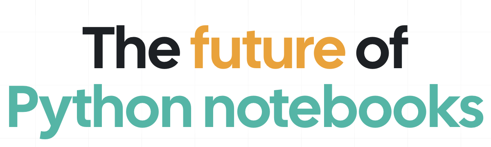

# Notebooks

## ¿Qué son?

<figure markdown>
  { width=80% }
  <figcaption>Cuadernos (notebooks) modernos</figcaption>
</figure>

Los cuadernos (_notebooks_) son archivos `.py` con una estructura específica, que se crean usando [**marimo**](https://marimo.io/). Esto permite que sean archivos en los que se combina texto (incluyendo LaTeX), código y gráficos de forma muy sencilla; y por lo tanto son muy útiles para documentar el proceso de análisis de datos y/o entrenamiento de modelos. Los cuadernos son una herramienta muy útil para la exploración de datos, la creación de prototipos y la documentación de resultados. También son muy útiles para explicar el proceso (los diferentes pasos y el racional de cada uno de ellos) llevado a cabo para llegar a un resultado o a una conclusión.

## ¿Cómo funcionan?

Para entender el funcionamiento de los cuadernos, se sugiere visitar la página de [**marimo**](https://marimo.io/), donde se explica cómo funcionan y cómo se pueden utilizar.

También se puede hacer uso de los tutoriales que provee **marimo**. Para esto, después de activar el uso de la práctica opcional (i.e. `uv sync ... --extra notebooks`), ejecute:

```sh
marimo tutorial intro
```

## Usar [marimo](https://marimo.io/)

Después de haber "instalado" el proyecto aplicando la práctica asociada con _notebooks_ (i.e. `uv sync ... --extra notebooks`), que habilita la herramienta (**marimo**) para crear y gestionar cuadernos, ejecute:

```sh
marimo edit
```

Esto abrirá una ventana en su navegador web con la interfaz de **marimo** para gestionar cuadernos. Desde allí podrá crear nuevos cuadernos, abrir los existentes y editarlos.
