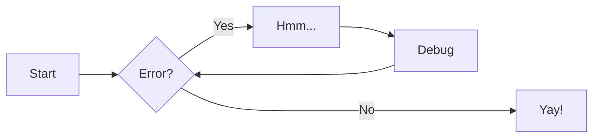

# Tutorial documentación

A continuación se incluyen algunos ejemplos para que funcionen como tutorial de las capacidades que están activas en la documentación.

## [Formato](https://squidfunk.github.io/mkdocs-material/reference/formatting/)

El texto puede ser {--borrado--} y se puede reemplazar con texto {++agregado++}. Esto también se puede combinar en {~~una~>una simple~~} operación. {==Resaltar==} también es posible {>> y se pueden agregar comentarios en línea<<}.

- ==Esto se resaltó==
- ^^Esto se insertó^^
- ~~Esto se borró~~

- H~2~O
- A^T^A

++ctrl+alt+del++

## [_Call outs_](https://squidfunk.github.io/mkdocs-material/reference/admonitions/)

!!! note
    Lorem ipsum dolor sit amet, consectetur adipiscing elit. Nulla et euismod nulla. Curabitur feugiat, tortor non consequat finibus, justo purus auctormassa, nec semper lorem quam in massa.

## [Botones](https://squidfunk.github.io/mkdocs-material/reference/buttons/)

[Enviar :fontawesome-solid-paper-plane:](#){ .md-button } [Enviar](#){ .md-button .md-button--primary }

## [Código](https://squidfunk.github.io/mkdocs-material/reference/code-blocks/)

```py title="Importar TensorFlow"
# (1)
import tensorflow as tf # (2)!
```

1. Para bloques sin título, remover `title="..."`

2. :man_raising_hand: Soy una anotación! Puedo contener `código`, __texto con
    formato__, imágenes, ... básicamente cualquier cosa que se pueda escribir
    con Markdown.

## [Pestañas](https://squidfunk.github.io/mkdocs-material/reference/content-tabs/)

=== "Unordered list"
    - Sed sagittis eleifend rutrum
    - Donec vitae suscipit est
    - Nulla tempor lobortis orci

=== "Ordered list"
    1. Sed sagittis eleifend rutrum
    2. Donec vitae suscipit est
    3. Nulla tempor lobortis orci

## [Tablas](https://squidfunk.github.io/mkdocs-material/reference/data-tables/)

| Method      | Description                          |
| ----------- | ------------------------------------ |
| `GET`       | :material-check:     Fetch resource  |
| `PUT`       | :material-check-all: Update resource |
| `DELETE`    | :material-close:     Delete resource |

## [Diagramas](https://squidfunk.github.io/mkdocs-material/reference/diagrams/)



## [Pies de Página](https://squidfunk.github.io/mkdocs-material/reference/footnotes/)

Lorem ipsum[^1] dolor sit amet, consectetur adipiscing elit.[^2]

[^1]: Lorem ipsum dolor sit amet, consectetur adipiscing elit.
[^2]: Prueba ...

## [Imágenes](https://squidfunk.github.io/mkdocs-material/reference/images/#left)

<figure markdown>
  { width="300" }
  <figcaption>Image caption</figcaption>
</figure>

## [Matemáticas](https://squidfunk.github.io/mkdocs-material/reference/math/#docsjavascriptskatexjs)

$$
\operatorname{ker} f=\{g\in G:f(g)=e_{H}\}
$$

The homomorphism $f$ is injective if and only if its kernel is only the singleton set $e_G$, because otherwise $\exists a,b\in G$ with $a\neq b$ such that $f(a)=f(b)$.

## [_Tooltips_](https://squidfunk.github.io/mkdocs-material/reference/tooltips/)

[Hover me](https://example.com "I'm a tooltip!")

The HTML specification is maintained by the W3C.

*[HTML]: Hyper Text Markup Language
*[W3C]: World Wide Web Consortium
